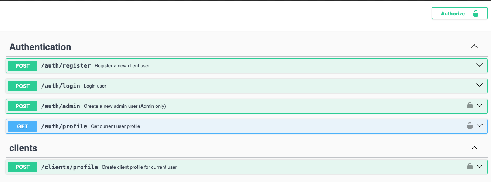
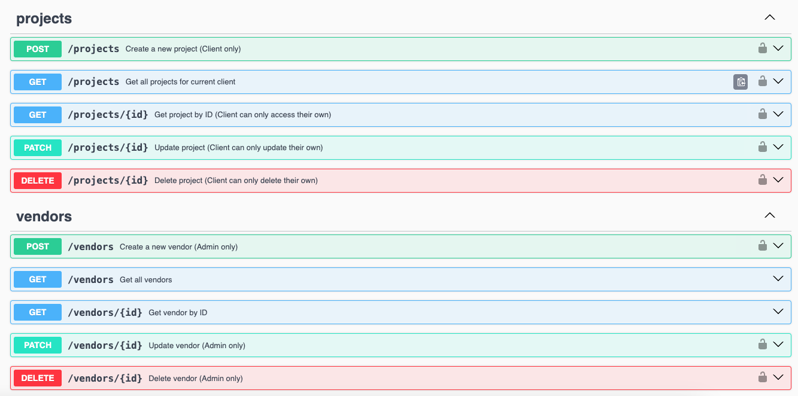
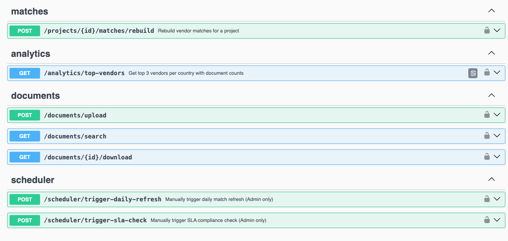

# 🌍 Global Expansion Management API

A comprehensive NestJS-based API for managing global business expansion projects, vendor relationships, and intelligent matching systems with real-time notifications and analytics.

## 📋 Table of Contents

- [🌍 Global Expansion Management API](#-global-expansion-management-api)
  - [📋 Table of Contents](#-table-of-contents)
  - [🚀 Features](#-features)
  - [🏗️ Architecture](#️-architecture)
  - [🛠️ Tech Stack](#️-tech-stack)
  - [📦 Installation & Setup](#-installation--setup)
  - [🔧 Configuration](#-configuration)
  - [🚀 Running the Application](#-running-the-application)
  - [🗄️ Database Setup](#️-database-setup)
  - [🔐 Authentication & Authorization](#-authentication--authorization)
  - [📊 API Endpoints](#-api-endpoints)
  - [🤖 Intelligent Matching System](#-intelligent-matching-system)
  - [📈 Analytics & Cross-Database Queries](#-analytics--cross-database-queries)
  - [📧 Notification System](#-notification-system)
  - [⏰ Scheduled Jobs](#-scheduled-jobs)
  - [📁 Project Structure](#-project-structure)
  - [📝 API Documentation](#-api-documentation)
  - [🚀 Deployment](#-deployment)
  - [🌐 Environment Variables](#-environment-variables)

## � Features

### Core Functionality

- ✅ **JWT Authentication** with role-based access control (Admin/Client)
- ✅ **Multi-Database Architecture** (MySQL + MongoDB)
- ✅ **Intelligent Vendor-Project Matching** with scoring algorithms
- ✅ **Real-time Email Notifications** via SMTP
- ✅ **Automated Scheduling** for match refresh and SLA monitoring
- ✅ **Cross-Database Analytics** combining relational and document data
- ✅ **Document Management** with upload, search, and tagging
- ✅ **RESTful API** with comprehensive Swagger documentation

### Advanced Features

- 🔄 **Idempotent Operations** for data consistency
- 📊 **Performance Analytics** with vendor scoring
- 🔍 **Advanced Search** across documents and projects
- 📧 **Template-based Notifications** with HTML emails
- ⚡ **Optimized Database Queries** with proper indexing
- 🛡️ **Input Validation** and sanitization
- 📈 **Scalable Architecture** with modular design

## 🏗️ Architecture

```
┌─────────────────┐    ┌─────────────────┐
│   Client Apps   │    │   Admin Panel   │
└─────────┬───────┘    └─────────┬───────┘
          │                      │
          └──────────────────────┼──────────────────────┘
                                 │
                    ┌─────────────┴─────────────┐
                    │     NestJS API Server     │
                    │   (Authentication &       │
                    │    Business Logic)        │
                    └─────────────┬─────────────┘
                                  │
                    ┌─────────────┴─────────────┐
                    │                           │
          ┌─────────┴─────────┐       ┌─────────┴─────────┐
          │   MySQL Database  │       │  MongoDB Database │
          │                   │       │                   │
          │ • Users           │       │ • Documents       │
          │ • Projects        │       │ • File Metadata   │
          │ • Vendors         │       │ • Search Indexes  │
          │ • Matches         │       │                   │
          │ • Analytics       │       │                   │
          └───────────────────┘       └───────────────────┘
```

## 🛠️ Tech Stack

### Backend Framework

- **NestJS** - Progressive Node.js framework
- **TypeScript** - Type-safe JavaScript

### Databases

- **MySQL** - Relational data (projects, vendors, matches)
- **MongoDB** - Document storage (research files, metadata)
- **TypeORM** - MySQL ORM with migrations
- **Mongoose** - MongoDB object modeling

### Authentication & Security

- **JWT** - JSON Web Tokens for authentication
- **bcryptjs** - Password hashing
- **Passport** - Authentication middleware
- **Class Validator** - Input validation

### Notifications & Scheduling

- **Nodemailer** - Email notifications
- **NestJS Schedule** - Cron jobs and task scheduling
- **HTML Templates** - Rich email formatting

### Documentation

- **Swagger/OpenAPI** - API documentation

### DevOps

- **Docker** - Containerization
- **Docker Compose** - Multi-container orchestration

## 📦 Installation & Setup

### Prerequisites

- Docker & Docker Compose

### Clone Repository

```bash
git clone https://github.com/your-username/global-expansion-management-api.git
cd global-expansion-management-api
```

## 🔧 Configuration

### Environment Setup

1. Copy the environment template:

```bash
cp .env.example .env
```

2. Configure your environment variables in `.env`:

```env
# Database Configuration
DB_HOST=localhost
DB_PORT=3307
DB_USERNAME=root
DB_PASSWORD=password
DB_DATABASE=expanders360

# MongoDB Configuration
MONGODB_URI=mongodb://localhost:27017/expanders360_docs

# JWT Configuration
JWT_SECRET=your-super-secret-jwt-key-change-this-in-production
JWT_EXPIRES_IN=1d

# Email Configuration (Optional)
EMAIL_ENABLED=true
SMTP_HOST=smtp.gmail.com
SMTP_PORT=587
SMTP_USER=your-email@gmail.com
SMTP_PASS=your-app-password
EMAIL_FROM=noreply@expanders360.com
ADMIN_EMAIL=admin@expanders360.com

# Scheduling Configuration
ENABLE_SCHEDULED_JOBS=true
```

## 🚀 Running the Application

### Docker Compose Setup

```bash
# Start all services (API + MySQL + MongoDB)
# The start.sh script automatically runs database seeding
docker-compose up --build

# Run in background
docker-compose up -d --build
```

**Note**: The Docker container automatically runs the seeding script via `scripts/start.sh`, so your database will be populated with sample data on startup.

### Email Testing

To test email notifications, add your real email credentials to the `.env` file:

```env
EMAIL_ENABLED=true
SMTP_HOST=smtp.gmail.com
SMTP_PORT=587
SMTP_USER=your-real-email@gmail.com
SMTP_PASS=your-app-password
EMAIL_FROM=noreply@expanders360.com
ADMIN_EMAIL=your-admin-email@gmail.com
```

## 🗄️ Database Setup

### MySQL Schema

The application uses the following main entities:

- **Users** - Authentication and user management
- **Clients** - Company information and contact details
- **Projects** - Expansion projects with requirements
- **Vendors** - Service providers with capabilities
- **Matches** - Project-vendor relationships with scores

### MongoDB Collections

- **Documents** - Research files and project documentation
- **Metadata** - File information and search indexes

### Sample Data

The seeding process creates:

- 2 Admin users
- 10+ Client companies
- 15+ Vendors across different regions
- 20+ Projects with various statuses
- Automatic match generation

## 🔐 Authentication & Authorization

### User Roles

- **Admin**: Full system access, vendor management, analytics
- **Client**: Project management, document upload, match viewing

### Authentication Flow

1. **Registration**: `POST /auth/register` (Client role)
2. **Login**: `POST /auth/login` (Returns JWT token)
3. **Protected Routes**: Include `Authorization: Bearer <token>` header

### Sample Credentials

```bash
# Admin Users
Email: effinbzz1@gmail.com
Email: effinbzz3@gmail.com
Password: admin123456

# Client Users
Email: ahmedgeuy159@gmail.com
Password: client123456
```

## 📊 API Endpoints

### Authentication

| Method | Endpoint         | Description         | Access        |
| ------ | ---------------- | ------------------- | ------------- |
| POST   | `/auth/register` | Register new client | Public        |
| POST   | `/auth/login`    | User login          | Public        |
| GET    | `/auth/profile`  | Get user profile    | Authenticated |

### Projects Management

| Method | Endpoint        | Description         | Access       |
| ------ | --------------- | ------------------- | ------------ |
| GET    | `/projects`     | Get user's projects | Client       |
| POST   | `/projects`     | Create new project  | Client       |
| GET    | `/projects/:id` | Get project details | Client/Admin |
| PATCH  | `/projects/:id` | Update project      | Client       |
| DELETE | `/projects/:id` | Delete project      | Client       |

### Vendor Management

| Method | Endpoint       | Description        | Access |
| ------ | -------------- | ------------------ | ------ |
| GET    | `/vendors`     | Get all vendors    | Public |
| POST   | `/vendors`     | Create vendor      | Admin  |
| GET    | `/vendors/:id` | Get vendor details | Public |
| PATCH  | `/vendors/:id` | Update vendor      | Admin  |
| DELETE | `/vendors/:id` | Delete vendor      | Admin  |

### Document Management

| Method | Endpoint                  | Description       | Access       |
| ------ | ------------------------- | ----------------- | ------------ |
| POST   | `/documents/upload`       | Upload document   | Client/Admin |
| GET    | `/documents/search`       | Search documents  | Client/Admin |
| GET    | `/documents/:id/download` | Download document | Client/Admin |

### Analytics

| Method | Endpoint                 | Description            | Access       |
| ------ | ------------------------ | ---------------------- | ------------ |
| GET    | `/analytics/top-vendors` | Top vendors by country | Client/Admin |

### Matching System

| Method | Endpoint                        | Description             | Access       |
| ------ | ------------------------------- | ----------------------- | ------------ |
| POST   | `/projects/:id/matches/rebuild` | Rebuild project matches | Client/Admin |

### Scheduler

| Method | Endpoint                           | Description          | Access |
| ------ | ---------------------------------- | -------------------- | ------ |
| POST   | `/scheduler/trigger-daily-refresh` | Manual match refresh | Admin  |
| POST   | `/scheduler/trigger-sla-check`     | Manual SLA check     | Admin  |

## 🤖 Intelligent Matching System

### Matching Algorithm

The system uses a sophisticated scoring algorithm to match vendors with projects:

```typescript
Score = (Service Overlap × 2) + Vendor Rating + SLA Weight
```

### Matching Criteria

1. **Geographic Coverage**: Vendor must support the project's target country
2. **Service Alignment**: At least one service overlap required
3. **Performance Scoring**: Based on rating and SLA commitments

### Scoring Components

- **Service Overlap**: +2 points per matching service
- **Vendor Rating**: 0-5 points based on historical performance
- **SLA Weight**: Bonus points for faster response commitments

### Example Match Process

```bash
Project: Germany expansion, needs ["IT Consulting", "Software Development"]
Vendor: EuroTech Solutions, offers ["IT Consulting", "Software Development", "Cloud Migration"]

Calculation:
- Service Overlap: 2 matches × 2 = 4 points
- Vendor Rating: 4.8 points
- SLA Weight: (48-8)/48 × 10 = 8.33 points
- Total Score: 17.13 points
```

## 📈 Analytics & Cross-Database Queries

### Top Vendors Analytics

The `/analytics/top-vendors` endpoint provides:

- **Top 3 vendors per country** (based on 30-day average match scores)
- **Document count** for expansion projects in each country
- **Cross-database aggregation** combining MySQL matches with MongoDB documents

### Implementation

```typescript
// MySQL Query: Get top vendors by match scores
const topVendors = await this.matchRepository
  .createQueryBuilder('match')
  .innerJoin('match.project', 'project')
  .innerJoin('match.vendor', 'vendor')
  .where('project.country = :country', { country })
  .andWhere('match.created_at >= :thirtyDaysAgo', { thirtyDaysAgo })
  .groupBy('vendor.id')
  .orderBy('AVG(match.score)', 'DESC')
  .limit(3);

// MongoDB Query: Count related documents
const documentCount = await this.documentModel.countDocuments({
  projectId: { $in: projectIds },
});
```

## 📧 Notification System

### Email Templates

- **Match Created**: Notifies clients of new vendor matches
- **SLA Violation**: Alerts admins of vendor performance issues
- **Daily Summary**: Reports match refresh results to admins

### SMTP Configuration

```env
EMAIL_ENABLED=true
SMTP_HOST=smtp.gmail.com
SMTP_PORT=587
SMTP_USER=your-email@gmail.com
SMTP_PASS=your-app-password
```

### Notification Triggers

1. **New Match Created**: Automatic email to project owner
2. **SLA Violations**: Immediate admin notifications
3. **Daily Summaries**: Scheduled reports on system activity

## ⏰ Scheduled Jobs

### Daily Match Refresh

- **Schedule**: Every day at 2:00 AM
- **Function**: Rebuilds matches for all active projects
- **Notification**: Sends summary email to admins

### SLA Compliance Check

- **Schedule**: Every 6 hours
- **Function**: Monitors vendor response times and commitments
- **Alerts**: Flags vendors with performance issues

### Manual Triggers

Both scheduled jobs can be triggered manually via API endpoints for testing and maintenance.

## 📁 Project Structure

```
src/
├── admins/              # Admin user management
├── analytics/           # Cross-database analytics
├── auth/               # Authentication & authorization
│   ├── decorators/     # Custom decorators
│   ├── dto/           # Data transfer objects
│   ├── guards/        # Route guards
│   └── strategies/    # Passport strategies
├── clients/           # Client management
├── config/            # Configuration files
├── database/          # Database configuration & seeds
│   └── seeds/         # Sample data generation
├── documents/         # MongoDB document management
│   ├── dto/          # Document DTOs
│   └── schemas/      # Mongoose schemas
├── matches/           # Vendor-project matching
├── notifications/     # Email notification system
│   └── templates/    # HTML email templates
├── projects/          # Project management
├── scheduler/         # Cron jobs & scheduled tasks
├── users/            # User entity & management
├── vendors/          # Vendor management
├── app.module.ts     # Main application module
└── main.ts          # Application entry point
```

## 📝 API Documentation

### Swagger UI

Access interactive API documentation at:

- **Local**: http://localhost:3000/api
- **Production**: http://16.170.223.83:3000/api

### Features

- Complete endpoint documentation
- Request/response schemas
- Authentication examples
- Try-it-out functionality
- Model definitions

### API Screenshots







## 🚀 Deployment

### AWS EC2 Deployment

The application is successfully deployed on AWS EC2 and accessible at: **http://16.170.223.83:3000/api**

#### Deployment Steps

1. **Create EC2 Instance**

   ```bash
   # Launch an EC2 instance (Ubuntu/Amazon Linux)
   # Configure security groups to allow ports 22 (SSH), 3000 (API), 3306 (MySQL), 27017 (MongoDB)
   ```

2. **Connect to EC2 Instance**

   ```bash
   # Connect via SSH using your key pair
   ssh -i your-key.pem ubuntu@16.170.223.83
   ```

3. **Install Docker & Dependencies**

   ```bash
   # Update system packages
   sudo apt update && sudo apt upgrade -y

   # Install Docker
   sudo apt install docker.io -y
   sudo systemctl start docker
   sudo systemctl enable docker

   # Install Docker Compose
   sudo curl -L "https://github.com/docker/compose/releases/download/v2.20.0/docker-compose-$(uname -s)-$(uname -m)" -o /usr/local/bin/docker-compose
   sudo chmod +x /usr/local/bin/docker-compose

   # Add user to docker group
   sudo usermod -aG docker $USER
   ```

4. **Clone Repository**

   ```bash
   # Install Git if not available
   sudo apt install git -y

   # Clone the repository
   git clone https://github.com/your-username/global-expansion-management-api.git
   cd global-expansion-management-api
   ```

5. **Configure Environment**

   ```bash
   # Copy and configure environment variables
   cp .env.example .env
   nano .env  # Edit with production values
   ```

6. **Deploy Application**

   ```bash
   # Build and start containers
   sudo docker-compose up -d --build

   # Check container status
   sudo docker-compose ps

   # View logs
   sudo docker-compose logs -f app
   ```

#### Production Environment Variables

```env
# Database Configuration (Production)
DB_HOST=mysql
DB_PORT=3306
DB_USERNAME=root
DB_PASSWORD=your-secure-password
DB_DATABASE=expanders360

# MongoDB Configuration
MONGODB_URI=mongodb://mongodb:27017/expanders360_docs

# JWT Configuration
JWT_SECRET=your-super-secure-jwt-secret-for-production
JWT_EXPIRES_IN=1d

# Email Configuration
EMAIL_ENABLED=true
SMTP_HOST=smtp.gmail.com
SMTP_PORT=587
SMTP_USER=your-production-email@gmail.com
SMTP_PASS=your-app-password
EMAIL_FROM=noreply@expanders360.com
ADMIN_EMAIL=admin@expanders360.com

# Application
NODE_ENV=production
PORT=3000

# Scheduling
ENABLE_SCHEDULED_JOBS=true
```

#### Security Considerations

- Configure EC2 security groups to restrict access
- Use strong passwords for database connections
- Set up SSL/TLS certificates for HTTPS
- Regular security updates and monitoring
- Backup strategies for databases

#### Monitoring & Maintenance

```bash
# Check application status
sudo docker-compose ps

# View application logs
sudo docker-compose logs -f app

# Restart services
sudo docker-compose restart

# Update application
git pull origin main
sudo docker-compose up -d --build
```

## 🌐 Environment Variables

### Required Variables

```env
# Database
DB_HOST=localhost
DB_PORT=3307
DB_USERNAME=root
DB_PASSWORD=password
DB_DATABASE=expanders360
MONGODB_URI=mongodb://localhost:27017/expanders360_docs

# Authentication
JWT_SECRET=your-secret-key
JWT_EXPIRES_IN=1d

# Application
NODE_ENV=development
PORT=3000
```

### Optional Variables

```env
# Email Notifications
EMAIL_ENABLED=false
SMTP_HOST=smtp.gmail.com
SMTP_PORT=587
SMTP_USER=your-email@gmail.com
SMTP_PASS=your-app-password
EMAIL_FROM=noreply@expanders360.com
ADMIN_EMAIL=admin@expanders360.com

# Scheduling
ENABLE_SCHEDULED_JOBS=true
```

---

## 🎯 Quick Start Summary

1. **Clone & Setup**: `git clone <repo> && cd <project>`
2. **Environment**: `cp .env.example .env` (add your real email credentials for testing)
3. **Start Services**: `docker-compose up --build`
4. **Access API**: http://localhost:3000/api

### Test Credentials

**Note**: These are seeded accounts with placeholder emails. For testing email notifications, update the database with your real email addresses or create new accounts with real emails to receive actual notification emails.

- **Admin**: `test@gmail.com` / `admin123456`
- **Client**: `test@gmail.com` / `client123456`

**🚀 Your Global Expansion Management API is ready to scale your business worldwide!**
